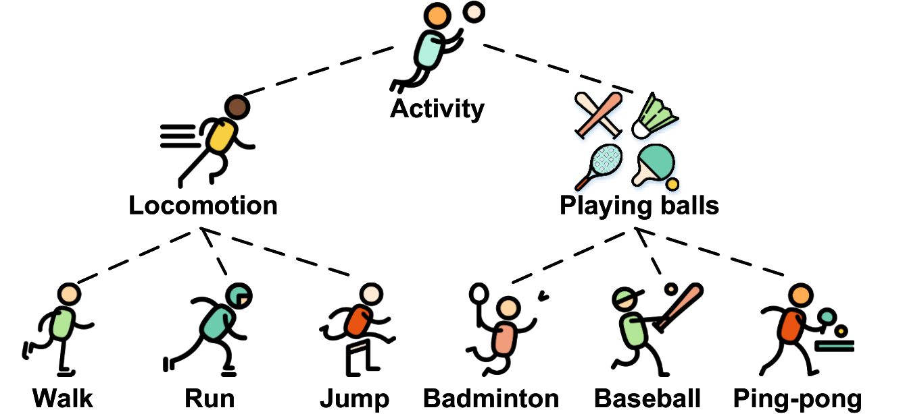
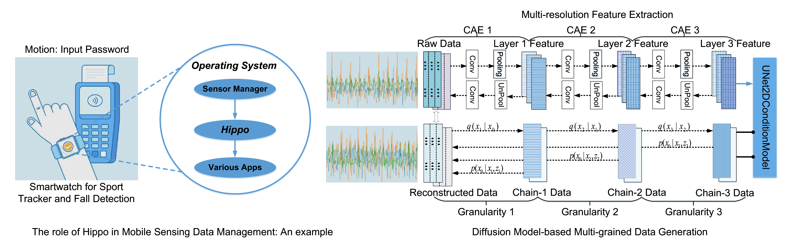

## Multi-grained Data Reconstruction for User-centric Mobile Activity Sensing Data Management

### Idea
Hippo is a hierarchical latent diffusion guidance framework to reconstruct multi-grained mobile sensing data. The idea comes from lossy compression: (i) encoding, the file is converted to a more compact format; (ii) decoding, the original file is restored but some information is discarded. For example, the JBIG2 format extracts areas that look similar and stores all similar areas as one copy. This copy is reused to reconstruct the image.
<p align="center">
  
</p>
Similarly, human activities have some common or similar behavioral characteristics. An activity can be decomposed into atomic actions, and the atomic actions are common or similar between different high-level activities. For example, the coarse-grained semantic category "locomotion" can be divided into fine-grained activities: "walking, running, and jumping". Taking a deeper look into jumping, it includes different subtle actions such as arms swinging, legs contracting, and stretching. Therefore, in this work, we try to generate multi-grained mobile activity-sensing data that contains different granularity of activity semantics with perturbed metadata information, so as to mitigate overprivileged mobile sensing privacy issues.

### Implementation
The implementation of Hippo includes two main parts: (i) encoding, convolutional autoencoder for multi-resolution latent representation extraction; (ii) decoding, latent representation guidance-based diffusion implicit model for hierarchical sensing data generation. Hippo generates multi-grained sensing data conditioned on random noise with the guidance of latent feature representations.

<p align="center">
  
</p>

Here is a source code folder to show the implementation of Hippo. In particular, train4hippo.py is used for training the model of Hippo, and hippo4gen.py is used for multi-grained data generation with a well-trained model. We acknowledge that part of the code is built upon the open-source project [diffusers](https://github.com/huggingface/diffusers).

Install the dependencies by running
```
pip install -r requirements.txt

python hippo4recon.py # set hyperparameters in config.py
```

### Evaluation
#### Datasets
We use the following four public activity sensing datasets:

**Dataset 1.** The [HARBox](https://github.com/xmouyang/FL-Datasets-for-HAR) dataset includes 9-axis Inertial Measurement Unit (IMU) data collected from 121 participants (17-55 years old) with 77 smartphone models in a crowdsourcing manner. The five activities of daily life are walking, hopping, calling, waving, and typing. The collected IMU data is resampled at 50 Hz, with a sliding window of 2 seconds. Thus, each data sample contains a 900-dimensional feature. Considering the large variety of users and devices, the dataset is heterogeneous enough to evaluate the robustness of different models.

**Dataset 2.** The [MotionSense](https://github.com/mmalekzadeh/motion-sense) dataset includes time-series data generated by accelerometers and gyroscopes in iPhone 6s, which is put into the front pocket of each participant. There are 24 participants, each with a unique combination of height, weight, age, and gender. They complete 6 activities in 15 trials: walking, jogging, sitting, standing, and downstairs and upstairs. The long trials are about 2 to 3 minutes and the short trials are around 30 seconds to 1 minute. The data is collected at a 50Hz sampling rate. The sensing data is collected by the SensingKit from the Core Motion framework on iOS devices. Note that to be consistent with the baselines, we use the four activities for comparison: downstairs, upstairs, walking, and jogging. 

**Dataset 3.** The [UCI HAR](https://archive.ics.uci.edu/ml/datasets/human+activity+recognition+using+smartphones) dataset includes 30 participants performing activities while carrying a waist-mounted Samsung Galaxy S II. Each participant performs activities of daily living: walking, upstairs, downstairs, sitting, standing, and laying. The accelerometer and gyroscope sensing data are collected at a constant rate of 50Hz. The sensing data is pre-processed by applying noise filters and segmented with a sliding window of 2.56 seconds and 50\% overlap.

**Dataset 4.** The [Daily and Sports Activity](https://archive.ics.uci.edu/ml/datasets/daily+and+sports+activities) dataset includes 19 types of daily and sports activities. Each of the 19 activities is performed for 5 minutes by every four females and four males. The 19 activities are walking, exercising on a stepper, exercising on a cross-trainer, rowing, jumping, and so on. The participants perform the activities in a flat outdoor area. The sampling rate is at 25Hz, and the 5-minute signals are divided into 5-second segments.

### Appendix: Data Generation with GAN

Hippo has two main modules: a prior that extracts hierarchical feature representations and a generator that reconstructs the sensing data from noise conditioned on representations. We consider a substitute part of the data generator module of Hippo: generative adversarial networks (GANs).

The generative models (e.g., diffusion models, GANs) can be regarded as a nonlinear parametric mapping $g:Z\rightarrow X$ to the data manifold, $Z$ is an open subset in $\mathcal{R}^d$, and $X$ is an open subset in $\mathcal{R}^D$.
The mapping is from a low dimensional space $Z$ to a manifold $M$ embedded in the higher dimensional space $X$. We propose that $M$ approximates the different granularity of the data manifold. We study the manifold approximation error of the generator, which minimizes a chosen divergence measure between the data distribution and the distribution of different granularity of the sensing data.
 
Ideally, we can learn the latent representation $z=h(x)$, where $z \in Z$, so that $g(h(x))=x$. However, in practice, $g$ can only learn an approximation to the true data manifold, which causes the approximation error. We utilize the approximation error to generate the privacy-preserving item. We control the semantic closeness between $x$ and $g(h(x))$, so the class label has different semantic granularity. The tangent space of a manifold generalizes to higher dimensions. We use the $J_{x}h$ to estimate the tangent space, of which the rows of $J_{x}h$ are the directions that approximately span the tangent space to the data manifold at $x$.

Note that several places can cause approximation errors, $M\sim \text{Manifold}$, $g(h(x))\sim x$, $h(g(z)\sim z$, so we only consider dominant tangent directions in the row span of $J_xh$. These can be obtained by the $SVD$ on the matrix $J_xh$, and get the right singular vectors. However, this process is expensive because, for each data sample, SVD needs to do it one by one. Kumar et al. propose to use GAN to estimate the tangent space to the data manifold. In this work, we take the stacked autoencoder, with the encoder-generator-discriminator triple to get the dominant tangent direction. A distribution $p_z$ over the space $Z$ results in a distribution $p_g$ over the space $X$, and we can get the sample $x=g(z)$ from the distribution by sampling $z\sim p_z$. The discriminator approximates a divergence measure between $p_g$ and the real data distribution $p_x$. We use $KL[p||q]$ to denote the KL divergence between the distributions $p$ and $q$ as follows:

$$\Delta_{KL}(r, x, \theta) \equiv KL[p(y|x, \theta) || p(y|x+r, \theta)]$$

$$r_{adv} \equiv argmax_r\{\Delta_{KL}(r, x, \theta); ||r||_2\leq\varepsilon\}$$

We train the generator using feature matching where the generator minimizes the mean discrepancy between the features of raw and generated data from an intermediate layer $l$ of the discriminator $f$. Meanwhile, we maximize the mean discrepancy between the features of raw data and generated data from the layer $l+1$ of the discriminator $f$. 

$$L_g=||E_x[f_l(x)]-E_z[f_l(g(z))]||^2_2-||E_x[f_{l+1}(x)]-E_z[f_{l+1}(g(z)]||^2_2$$

In this way, we can train the GAN to generate new data based on the different levels of latent representations, which correspond to different granularity of activity semantics learned by neural network models.
